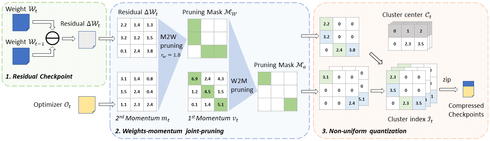
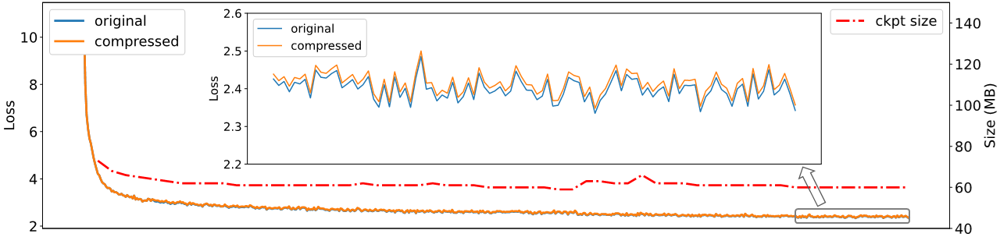

# ExCP
### **ExCP: Extreme LLM Checkpoint Compression via Weight-Momentum Joint Shrinking**

*Wenshuo Li, Xinghao Chen, Han Shu, Yehui Tang, Yunhe Wang*

*ICML 2024 Oral*

<a href="https://arxiv.org/abs/2406.11257"></a>


## Updates
* **2024/06/21**: Thanks to the contribution of Cbtor, there is an unofficial serial checkpoints of Pythia-410M [checkpoints](https://huggingface.co/Cbtor/ExCP). You can use `scripts/recon_ckpts.sh` to reconstruct all checkpoints during the training process.
* **2024/06/14**: Training and compressing codes of Pythia-410M are released [here](https://github.com/Gaffey/ExCP).

## Overview
We propose a novel Extreme Checkpoint Compression (ExCP) framework, which significantly reduces the required storage of training checkpoints while achieving nearly lossless performance. We first calculate the residuals of adjacent checkpoints to obtain the essential but sparse information for higher compression ratio. To further excavate the redundancy parameters in checkpoints, we then propose a weight-momentum joint shrinking method to utilize another important information during the model optimization, i.e., momentum. In particular, we exploit the information of both model and optimizer to discard as many parameters as possible while preserving critical information to ensure optimal performance. Furthermore, we utilize non-uniform quantization to further compress the storage of checkpoints.


<div align=center>
<sup>Figure 1: Overall framework of ExCP.</sup>
</div>

## Requirements
```
pip install -r requirements.txt
```

## Usage

### Training and Compression

1. Pick corresponding data from [PILE](https://the-eye.eu/public/AI/pile/) dataset according to the lists in `./datalist`, and save the data at `[pos1]/[pos2]`.

```
python generate_subdataset.py --pile_path [PILE] --datalist ./datalist/datalist1.txt --save_path [pos1]
python generate_subdataset.py --pile_path [PILE] --datalist ./datalist/datalist2.txt --save_path [pos2]
```

2. Run the scripts.

```
bash scripts/pretrain_phase1.sh [pos1]
bash scripts/pretrain_phase2.sh [pos2]
```

If you use the cached data, please uncomment the `--data_cache_dir` and `--read_cached` option.

3. If you want to evaluate the model, you may use [open-compass](https://github.com/open-compass/opencompass).

## Results
|    Model    |     Method     |  Size | hellaswag | arc-e |  piqa |   C3  |  csl  | lambada |  Avg  |
|:-----------:|:--------------:|:-----:|:---------:|:-----:|:-----:|:-----:|:-----:|:-------:|:-----:|
|                        | Original model | 4.53G |   32.52   | 35.80 | 62.13 | 37.21 | 53.75 |  37.22  | 43.11 |
|  Pythia-410M           |  Residual+7Zip | 3.40G |   32.52   | 35.80 | 62.13 | 37.21 | 53.75 |  37.22  | 43.11 |
|             |   ExCP (Ours)  | 0.06G |   31.95   | 37.04 | 62.62 | 36.22 | 52.50 |  37.24  | 42.93 |



<div align=center>
<sup>Figure 2: Loss and checkpoint size curve of original Pythia-410M and compressed Pythia-410M.</sup>
</div>

## Acknowledgements
We thank the following projects: [transformers](https://github.com/huggingface/transformers), [stanford_alpaca](https://github.com/tatsu-lab/stanford_alpaca), [open-compass](https://github.com/open-compass/opencompass).

## Citation
```bibtex
@inproceedings{liexcp,
  title={ExCP: Extreme LLM Checkpoint Compression via Weight-Momentum Joint Shrinking},
  author={Li, Wenshuo and Chen, Xinghao and Shu, Han and Tang, Yehui and Wang, Yunhe},
  booktitle={Forty-first International Conference on Machine Learning}
}
```

## License

This project is licensed under <a rel="license" href="License.txt"> Apache License 2.0</a>. Redistribution and use should follow this license.
